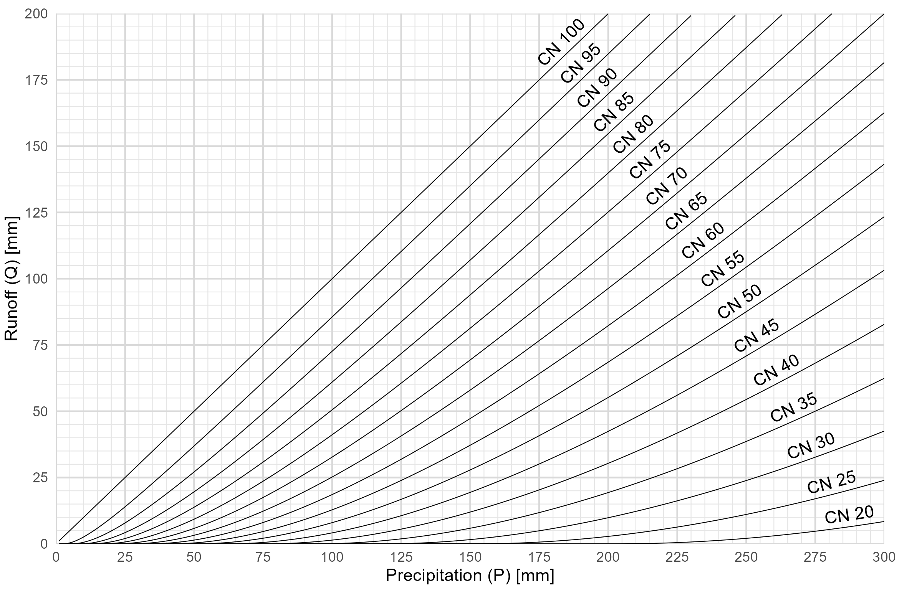

# Curve number graph

R code to create this historic graph (source unknown) of precipitation versus flow (Q) for a range of curve numbers. If you know the source of the historic version, please let us know.

This is a reproduction using R code. 

