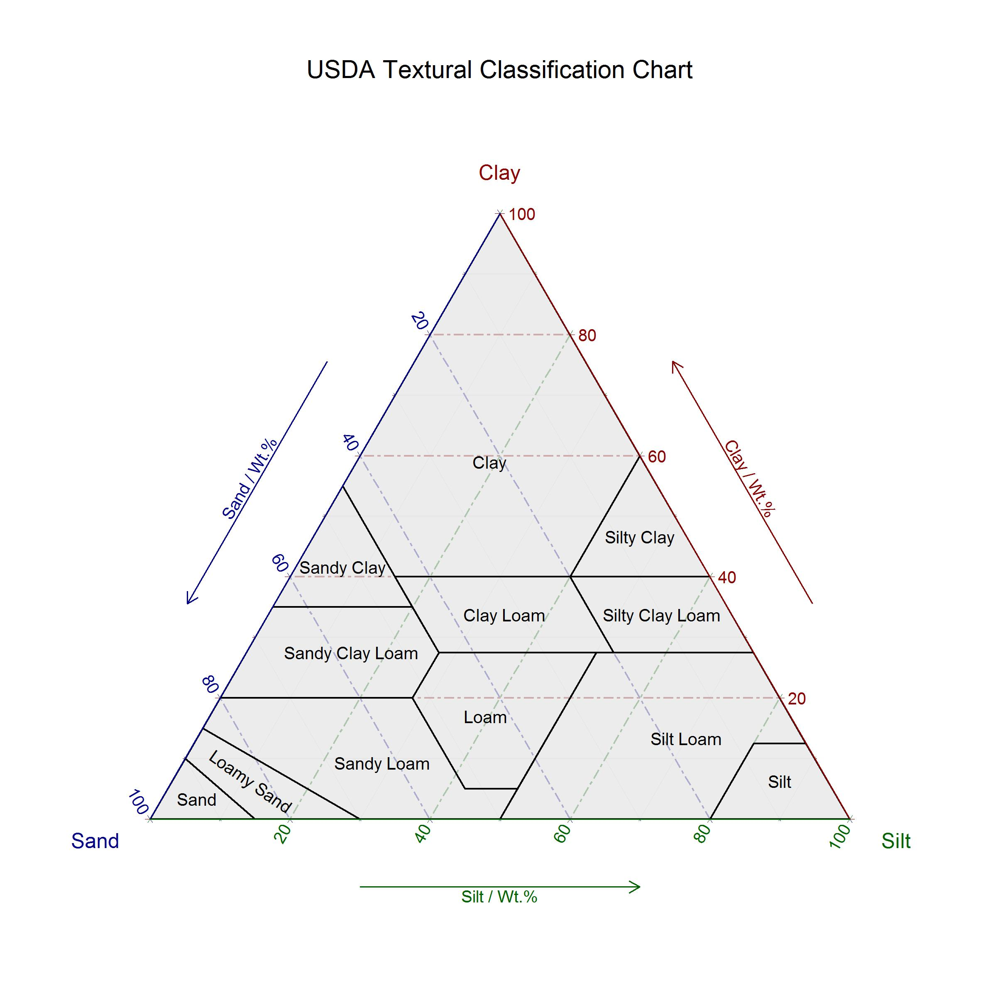

# Curve number graph

A historic graph (source unknown) of precipitation versus flow (Q) for a range of curve numbers that has been scanned too many times. If you know the source of the historic version, please let us know.

The reproduced graph using R code found in the 'curve_number_graph' directory.

# USDA Soil Texture Triangle

Code to produce a soil texture triangel found in 'USDA_soil_texture_triangle'

